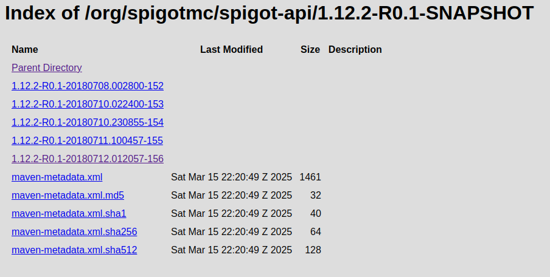

Recently, I can't publish my new library ([CraftUX](https://github.com/ProjectUnified/CraftUX)) to Maven Central. When I check the logs, I get this error message:
```
Deployment 96d80****** failed
pkg:maven/io.github.projectunified/craftux-spigot@1.0.0:
 - Dependencies to SNAPSHOT versions not allowed for dependency: org.spigotmc:spigot-api
```

It looks like Maven Central just changed its policy and no longer supports SNAPSHOT dependencies on its release repository.

It would be fine if I can just change the version of the dependency to use a release version instead of `SNAPSHOT`. However, the problem is that the `org.spigotmc:spigot-api` dependency is published in SpigotMC's repository, and they only provide SNAPSHOT versions, which are not allowed on Maven Central's release repository.

Luckily, there is a workaround. Nexus, the repository manager that powers SpigotMC's repository, stores the dependency with the timestamped version. We can use this version instead of the SNAPSHOT version.

When accessing the repository at one of the version (`1.12.2-R0.1-SNAPSHOT` for example), we can find the list of timestamped versions of the dependency like this:


We can use one of the timestamped versions to replace the SNAPSHOT version in our `pom.xml` file. For example, if we want to use the version `1.12.2-R0.1-20180712.012057-156`, we can modify our `pom.xml` file like this:
```xml
<dependency>
    <groupId>org.spigotmc</groupId>
    <artifactId>spigot-api</artifactId>
    <version>1.12.2-R0.1-20180712.012057-156</version>
</dependency>
```

Now my library is ready to be published to Maven Central!

You can use the same workaround for any repository that has timestamped versions of its dependencies (such as PaperMC's repository).

For other repositories that do not have timestamped versions of their dependencies, you can host your own copy of the dependency in your own repository. There are many tutorials available online that can guide you through the process of setting up your own repository.

The easiest way (in my opinion) is to host a Maven repository in a Github Pages site. You can access a tutorial like this one: [How to use github as a maven repository
](https://gist.github.com/cleberjamaral/6c9b0a615e51e26c94ffe407a641f531).

Just remember to NOT use `-SNAPSHOT` in the `version`.
